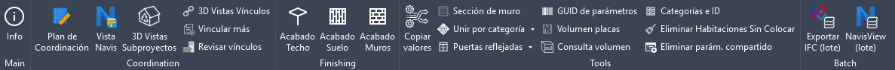

[English](README.md) | [Русский](README.ru.md) | [Español](README.es.md)

# pyArchitect

## Extensión de pyRevit para la productividad

Extensión de pyRevit para arquitectura, diseño de interiores y coordinación BIM.
Está pensada para quitarle al arquitecto el trabajo repetitivo y mantener el proyecto
ordenado.

Todas las herramientas están traducidas al inglés, al ruso y al español — el idioma se
toma de la interfaz de Revit.

### Instalación

pyArchitect funciona sobre [pyRevit](https://github.com/eirannejad/pyRevit/releases):
instálalo primero, o comprueba que ya esté instalado. Después añade la extensión de una
de estas dos maneras.

#### Desde la ventana Extensions de pyRevit

pyArchitect figura en el catálogo de extensiones del propio pyRevit, así que se puede
instalar sin usar la línea de comandos:

* En Revit, ve a la pestaña **pyRevit** => panel **pyRevit** => **Extensions**
* Busca **pyArchitect** en la lista de extensiones disponibles
* Pulsa **Install Extension** y elige la carpeta donde instalarla
* Reinicia Revit — la pestaña **pyArchitect** aparecerá al siguiente inicio

#### Desde la línea de comandos

* Abre el símbolo del sistema (Win + R) => `cmd`
* Ejecuta el siguiente comando : `pyrevit extend ui pyArchitect https://github.com/romangolev/pyArchitect.git`
* La pestaña **pyArchitect** aparecerá al iniciar Revit

### Actualización

Al iniciar Revit, pyArchitect compara su versión con la del repositorio y avisa cuando
hay una nueva. Para instalarla, usa el botón **Update** del propio pyRevit, que
descarga los últimos commits de todas las extensiones instaladas.

### Funciones

Así se ve la extensión en la cinta: 
La pestaña contiene los siguientes paneles:

* **Main** — panel de control e información sobre la extensión
* **Coordination** — herramientas para la coordinación del modelo
* **Finishing** — herramientas para los acabados de interiores
* **Tools** — herramientas varias
* **Batch** — coordinación y exportación por lotes sobre muchos modelos a la vez

Cada herramienta lleva su propia descripción. Para verla, pasa el ratón por encima del botón y espera un momento.

| Panel | Herramienta | Qué hace |
| --- | --- | --- |
| Main | Info | Información básica sobre el proyecto actual y la extensión, más la versión instalada y la última disponible. Funciona sin documento abierto |
| Coordination | Plan de Coordinación | Crea un nuevo plan de coordinación orientado al norte real y revela el punto base y el punto de levantamiento |
| Coordination | Vista Navis | Crea o actualiza la vista 3D de Navisworks según el perfil elegido. Shift+Clic define el perfil por defecto y edita los presets |
| Coordination | 3D Vistas Subproyectos | Crea vistas 3D basadas en conjuntos de trabajo |
| Coordination | 3D Vistas Vínculos | Crea vistas 3D basadas en vínculos |
| Coordination | Vincular más | Crea muchos vínculos RVT, DWG o IFC a la vez |
| Coordination | Revisar vínculos | Comprueba que los vínculos estén anclados y en un conjunto de trabajo propio (`##Link_`), y corrige lo que no lo esté |
| Finishing | Acabado de techo | Crea el acabado de techo de las habitaciones seleccionadas, con desplazamiento opcional por su espesor |
| Finishing | Acabado de suelo | Crea el acabado de suelo de las habitaciones seleccionadas, con desplazamiento opcional por su espesor |
| Finishing | Acabado de muros | Crea una segunda capa de muros dentro de las habitaciones seleccionadas — útil para las mediciones de trabajos de interior |
| Tools | Copiar valores | Copia el valor de un parámetro de una propiedad a otra. Shift+Clic imprime un informe detallado de la transferencia |
| Tools | Sección de muro | Crea una sección alrededor de cada muro seleccionado |
| Tools | Unir por categoría | Une todos los elementos de una categoría a los elementos que elijas y corrige el aviso de elementos unidos que no se intersecan |
| Tools | Unir por selección | Une entre sí dos grupos de elementos seleccionados y corrige el mismo aviso |
| Tools | Puertas reflejadas | Selecciona todas las instancias de puerta reflejadas |
| Tools | Ventanas reflejadas | Selecciona todas las instancias de ventana reflejadas |
| Tools | GUID de parámetros | Lista los parámetros compartidos del proyecto junto con sus GUID |
| Tools | Volumen de placas | Anota el volumen y la masa de todas las placas en el parámetro Comentarios |
| Tools | Consulta de volumen | Devuelve el volumen de los elementos seleccionados y calcula el total en metros cúbicos |
| Tools | Categorías e ID | Lista las categorías del modelo con sus ID |
| Tools | Eliminar Habitaciones Sin Colocar | Elimina del proyecto todas las habitaciones sin colocar |
| Tools | Eliminar parámetro compartido | Elimina por lotes los parámetros compartidos elegidos, de modo que después se pueda añadir un parámetro con el mismo GUID y distintas propiedades |
| Tools | Todos los elementos de categoría | Selecciona todos los elementos de la categoría elegida |
| Batch | Exportar IFC (lote) | Exportación por lotes de modelos de Revit a IFC |
| Batch | NavisView (lote) | Crea la vista de exportación a Navisworks en un lote de modelos de Revit |

#### Herramientas por lotes

Las dos funcionan **sin documento abierto** — lánzalas desde una sesión de Revit vacía.
Comparten el mismo formulario:

* **Source** — los modelos se eligen desde una carpeta local, desde rutas de Revit
  Server o desde un CSV con las columnas `SourcePath` y `Options`.
* **Selection** — la lista de modelos encontrados y los ajustes de cada uno.
* **Options** — los ajustes con los que se ejecuta todo el lote.

Cada modelo se abre en segundo plano y se procesa por separado.

*Exportar IFC (lote)* resuelve en cada modelo la vista 3D solicitada y la exporta a IFC
con los ajustes de la pestaña Options: versión IFC, conjuntos de propiedades,
cantidades base, tratamiento de los vínculos y carpeta de exportación.

*NavisView (lote)* prepara en cada modelo una vista 3D para Navisworks. Un perfil decide
qué categorías se ocultan; se deduce del nombre del archivo y puede cambiarse por
modelo. Eliges entre escribir copias en una carpeta o editar y guardar los modelos de
origen.

**Shift+Clic** en cualquiera de los dos botones abre los ajustes — opciones de
exportación, ajustes de la vista y perfiles de Navisworks — sin ejecutar el lote.

### Resolución de problemas

Si la extensión no carga, borra todos los archivos del directorio `%AppData%\Roaming\pyRevit\Extensions\pyArchitect.extension` junto con la carpeta `pyArchitect.extension`, y vuelve a instalarla siguiendo la sección de Instalación.

Los ajustes se guardan en un único archivo, `pyrevit_pyArchitect.ini`, en la carpeta
appdata de pyRevit. Borrarlo devuelve la extensión a sus valores por defecto.

### Licencia

Publicado bajo la [GNU General Public License v3.0](LICENSE).

### Agradecimientos

Muchas gracias a:

* [Ehsan Iran-Nejad](https://github.com/eirannejad) por crear una gran herramienta e inspirar a miles de entusiastas del BIM
* [Jean-Marc Couffin](https://github.com/jmcouffin) por hacer que pyArchitect esté disponible en la lista de extensiones de pyRevit
* [Alex Melnikov](https://github.com/melnikovalex) por compartir la extensión pyApex
