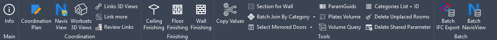

[English](README.md) | [Русский](README.ru.md) | [Español](README.es.md)

# pyArchitect

## pyRevit extension for productivity

This is a pyRevit extension for Architectural, Interior design and BIM Coordination.
The extension is developed to help architects reduce routine tasks and help
the project to be organized and neat.

Every button is localized in English, Russian and Spanish — Revit picks the language
of its own UI.

### Installation

pyArchitect runs on top of [pyRevit](https://github.com/eirannejad/pyRevit/releases) —
install it first, or make sure it´s already installed. Then add the extension in one of
two ways.

#### From the pyRevit Extensions window

pyArchitect is listed in pyRevit's own extension catalogue, so it can be installed
without touching the command line:

* In Revit, go to the **pyRevit** tab => **pyRevit** panel => **Extensions**
* Find **pyArchitect** in the list of available extensions
* Press **Install Extension** and pick the folder to install it into
* Restart Revit — the **pyArchitect** tab appears on the next start

#### From the command line

* Open the command prompt (Win + R) => `cmd`
* Run the following command : `pyrevit extend ui pyArchitect https://github.com/romangolev/pyArchitect.git`
* A panel **pyArchitect** should appear on the next start of Revit

### Updating

pyArchitect checks the repository on Revit start and shows a toast when a newer
version has been published. To install it, use pyRevit's own **Update** button,
which pulls the latest commits for every installed extension.

### Features

Main extension itself looks the following way: 
Extension has several panels in the tab:

* **Main** — control panel, information about the extension
* **Coordination** — tools for model coordination
* **Finishing** — bundle for architecture interior works
* **Tools** — miscellaneous tools
* **Batch** — run coordination and export work over many models at once

Every tool has an embedded description. To see the description and hint, hover mouse over the button.

| Panel | Tool | What it does |
| --- | --- | --- |
| Main | Info | Basic information about the current project and the extension, plus the installed and latest available versions. Runs without an open document |
| Coordination | Coordination Plan | Creates a new coordination plan, oriented to true north, revealing the Base Point and the Survey Point |
| Coordination | Navis View | Creates or updates the Navisworks 3D view from the selected profile. Shift+Click sets the default profile and edits presets |
| Coordination | Worksets 3D Views | Creates a 3D view per workset |
| Coordination | Links 3D Views | Creates a 3D view per linked model |
| Coordination | Link more | Creates many RVT, DWG or IFC links at once |
| Coordination | Review Links | Checks that links are pinned and sit on their own `##Link_` workset, and fixes what is not |
| Finishing | Ceiling Finishing | Creates ceiling finishing for the selected rooms, optionally offset by its own thickness |
| Finishing | Floor Finishing | Creates floor finishing for the selected rooms, optionally offset by its own thickness |
| Finishing | Wall Finishing | Creates a second layer of walls inside the selected rooms — useful for interior works specifications |
| Tools | Copy Values | Copies a parameter value from one property to another. Shift+Click prints a detailed transfer report |
| Tools | Section for Wall | Creates a section around each selected wall |
| Tools | Batch Join By Category | Joins every element of a chosen category to the elements you pick, and clears the "joined but not intersecting" warning |
| Tools | Batch Join By Selection | Joins two picked sets of elements to each other, and clears the same warning |
| Tools | Select Mirrored Doors | Selects all door instances that have been mirrored |
| Tools | Select Mirrored Windows | Selects all window instances that have been mirrored |
| Tools | Shared Param GUIDs | Lists the shared parameters of the project together with their GUIDs |
| Tools | Plates Volume | Writes the volume and mass of all plates into the Comments parameter |
| Tools | Volume Query | Returns the volume of the selected elements and totals it in cubic meters |
| Tools | Categories List + ID | Lists the categories of the model with their IDs |
| Tools | Convert In-Place to Family | Creates a loadable RFA from one selected model-in-place component, reloads it, places it back at the same location, then removes the original |
| Tools | Delete Unplaced Rooms | Removes all unplaced rooms from the project |
| Tools | Delete Shared Parameter | Removes the selected shared parameters from the project in one batch, so a parameter with the same GUID but different properties can be added afterwards |
| Tools | All Elements Of Category | Selects every element of the chosen category |
| Batch | Batch IFC Export | Exports a batch of Revit models to IFC |
| Batch | Batch NavisView | Creates the Navisworks export view in a batch of Revit models |

#### Batch tools

Both batch tools run **without an open document** — start them from an empty Revit
session. They share the same form:

* **Source** — pick the models from a local folder, from Revit Server routes, or from
  a CSV with `SourcePath` and `Options` columns.
* **Selection** — review the models found, and adjust the per-model options.
* **Options** — the settings the whole batch runs with.

Each model is opened in the background and processed on its own.

*Batch IFC Export* resolves the requested 3D view in every model and exports it to IFC
with the settings from the Options tab: IFC version, property sets, base quantities,
how linked models are handled, and the export folder.

*Batch NavisView* sets up a 3D view for Navisworks in every model. A profile decides
which categories are hidden; the profile is guessed from the file name and can be
changed per model. You choose whether to write output copies into a folder or to edit
and save the source models in place.

**Shift+Click** on either button opens the settings — export options, view settings and
Navisworks profiles — without running a batch.

### Troubleshooting

When having an issues with loading extension, delete all files from the following directory: `%AppData%\Roaming\pyRevit\Extensions\pyArchitect.extension` as well as `pyArchitect.extension` folder. Then reinstall extension as described in Installation section.

Settings live in a single file, `pyrevit_pyArchitect.ini`, in pyRevit's appdata folder.
Deleting it resets the extension to its defaults.

### License

Released under the [GNU General Public License v3.0](LICENSE).

### Shoutouts

Big thanks to:

* [Ehsan Iran-Nejad](https://github.com/eirannejad) for designing great tool and inspiring thousands of BIM enthusiasts
* [Jean-Marc Couffin](https://github.com/jmcouffin) for making pyArchitect available from the extension list in pyRevit
* [Alex Melnikov](https://github.com/melnikovalex) for sharing pyApex extension
