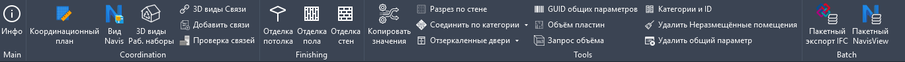

[English](README.md) | [Русский](README.ru.md) | [Español](README.es.md)

# pyArchitect

## Расширение pyRevit для продуктивной работы

Расширение pyRevit для архитектуры, дизайна интерьеров и BIM-координации.
Создано для того, чтобы избавить архитектора от рутины и держать проект в порядке.

Все инструменты переведены на английский, русский и испанский — язык подхватывается
из интерфейса Revit.

### Установка

pyArchitect работает поверх [pyRevit](https://github.com/eirannejad/pyRevit/releases) —
сначала установите его или убедитесь, что он уже установлен. Дальше расширение
добавляется одним из двух способов.

#### Через окно Extensions в pyRevit

pyArchitect есть в собственном каталоге расширений pyRevit, поэтому его можно
установить без командной строки:

* В Revit открыть вкладку **pyRevit** => панель **pyRevit** => **Extensions**
* Найти **pyArchitect** в списке доступных расширений
* Нажать **Install Extension** и выбрать папку для установки
* Перезапустить Revit — при следующем запуске появится вкладка **pyArchitect**

#### Через командную строку

* Открыть командную строку (Win + R) => `cmd`
* Выполнить команду : `pyrevit extend ui pyArchitect https://github.com/romangolev/pyArchitect.git`
* При запуске Revit появится вкладка **pyArchitect**

### Обновление

При запуске Revit pyArchitect сверяет версию с репозиторием и показывает уведомление,
если вышла новая. Установить её можно кнопкой **Update** самого pyRevit — она
подтягивает свежие коммиты для всех установленных расширений.

### Функции

Основные функции расширения представлены на вкладке pyArchitect.

Представлены следующие панели:

* **Main** — панель управления расширением и основная информация о расширении
* **Coordination** — набор инструментов для координации проекта
* **Finishing** — панель инструментов по созданию/специфицированию элементов отделки
* **Tools** — панель вспомогательных инструментов
* **Batch** — пакетная обработка: координация и экспорт сразу по множеству моделей

Каждый инструмент обладает встроенной подсказкой. Для того, чтобы увидеть её, необходимо навести на инструмент и немного подождать.

| Панель | Инструмент | Что делает |
| --- | --- | --- |
| Main | Инфо | Информация о проекте, программе и расширении, а также об установленной и последней доступной версии. Работает без открытой модели |
| Coordination | Координационный план | Создаёт новый координационный план, ориентированный на истинный север, и показывает базовую точку и точку съёмки |
| Coordination | Вид Navis | Создаёт или обновляет 3D вид для Navisworks по выбранному профилю. Shift+Click — профиль по умолчанию и редактирование пресетов |
| Coordination | 3D виды: рабочие наборы | Создаёт 3D виды на основе видимости рабочих наборов |
| Coordination | 3D виды: связи | Создаёт 3D виды на основе связанных файлов |
| Coordination | Добавить связи | Создаёт множество связей RVT, DWG или IFC одновременно |
| Coordination | Проверка связей | Проверяет, закреплены ли связи и находятся ли они на отдельном рабочем наборе (`##Link_`), и исправляет эти ошибки |
| Finishing | Отделка потолка | Создаёт отделку потолка для выбранных помещений, при необходимости со смещением на толщину |
| Finishing | Отделка пола | Создаёт отделку пола для выбранных помещений, при необходимости со смещением на толщину |
| Finishing | Отделка стен | Создаёт отделку стен внутри выбранных помещений — удобно для спецификаций на внутренние работы |
| Tools | Копировать значения | Копирует значение параметра из одного свойства в другое. Shift+Click — подробный отчёт в вывод |
| Tools | Разрез по стене | Создаёт отдельный разрез для каждой выбранной стены |
| Tools | Соединить по категории | Присоединяет все элементы выбранной категории к указанным элементам и устраняет предупреждение о присоединённых, но не пересекающихся элементах |
| Tools | Соединить по выбору | Присоединяет две выбранные группы элементов друг к другу и устраняет то же предупреждение |
| Tools | Отзеркаленные двери | Выделяет все отзеркаленные двери |
| Tools | Отзеркаленные окна | Выделяет все отзеркаленные окна |
| Tools | GUID общих параметров | Выводит список общих параметров проекта вместе с их GUID |
| Tools | Объём пластин | Записывает объём и массу всех пластин в параметр «Комментарии» |
| Tools | Запрос объёма | Возвращает объём выбранных элементов и считает итог в кубических метрах |
| Tools | Категории и ID | Выводит список категорий модели с их ID |
| Tools | Удалить неразмещённые помещения | Удаляет все неразмещённые помещения из проекта |
| Tools | Удалить общий параметр | Пакетно удаляет выбранные общие параметры из проекта, после чего можно добавить параметр с тем же GUID, но другими свойствами |
| Tools | Все элементы категории | Выбирает все элементы заданной категории |
| Batch | Пакетный экспорт IFC | Пакетный экспорт моделей Revit в IFC |
| Batch | Пакетный NavisView | Создание вида для экспорта в Navisworks в пакете моделей Revit |

#### Пакетные инструменты

Оба инструмента работают **без открытой модели** — запускайте их из пустой сессии
Revit. Форма у них общая:

* **Source** — модели выбираются из локальной папки, по маршрутам Revit Server или из
  CSV со столбцами `SourcePath` и `Options`.
* **Selection** — список найденных моделей и настройки для каждой из них.
* **Options** — параметры, с которыми отрабатывает весь пакет.

Каждая модель открывается в фоне и обрабатывается отдельно.

*Пакетный экспорт IFC* находит в каждой модели нужный 3D вид и выгружает его в IFC с
настройками из вкладки Options: версия IFC, наборы свойств, базовые величины,
обработка связей и папка экспорта.

*Пакетный NavisView* создаёт в каждой модели 3D вид для Navisworks. Профиль определяет,
какие категории скрыты; профиль угадывается по имени файла и меняется для каждой
модели. Можно записывать копии в отдельную папку либо изменять и сохранять исходные
модели.

**Shift+Click** по любой из кнопок открывает настройки — параметры экспорта, настройки
вида и профили Navisworks — не запуская пакет.

### Устранение неполадок

При возникновении неполадок, необходимо удалить приложение из пользовательской директории `%AppData%\Roaming\pyRevit\Extensions\pyArchitect.extension` вместе с директорией `pyArchitect.extension` и установить расширение заново, выполнив инструкцию по установке.

Настройки хранятся в одном файле `pyrevit_pyArchitect.ini` в папке appdata pyRevit.
Его удаление возвращает расширение к настройкам по умолчанию.

### Лицензия

Распространяется по лицензии [GNU General Public License v3.0](LICENSE).

### Благодарности

Большое спасибо:

* [Ehsan Iran-Nejad](https://github.com/eirannejad) — за прекрасный инструмент, вдохновивший тысячи BIM-энтузиастов
* [Jean-Marc Couffin](https://github.com/jmcouffin) — за то, что pyArchitect доступен в списке расширений pyRevit
* [Alex Melnikov](https://github.com/melnikovalex) — за расширение pyApex
